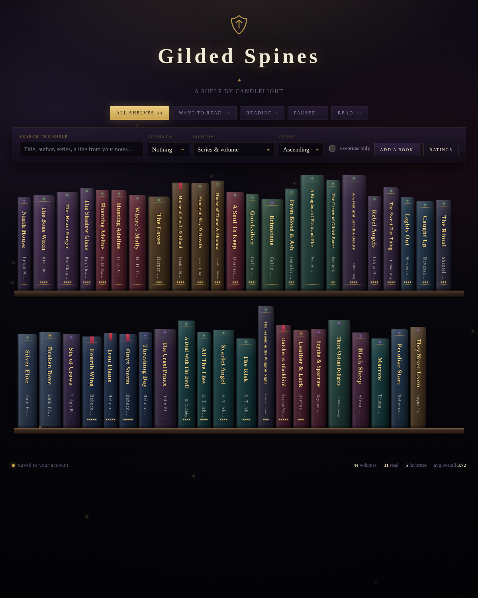

# Gilded Spines

A book tracker that looks like a shelf by candlelight. Books stand as spines with
gilt lettering; click one and it opens to a two-page spread — facts on the recto,
your notes and theories on the verso.



## What it does

- **Shelves.** All / Want to Read / Reading / Paused / Read, with live counts.
- **Spines, packed onto real shelves.** Books are laid into rows that fill each
  plank; longer titles get taller books, and the lettering is sized to the space
  it actually has so nothing ellipsises into mush.
- **Open like a book.** A spread with a centre gutter and a page-turn on the
  right-hand page. Left page: title, author, series, volume, shelf, progress,
  blurb, ratings.
- **Note sections you name yourself.** The right-hand page starts with Notes,
  Theories & Predictions and Lines Worth Keeping, and every one of them can be
  renamed, reordered, deleted or added to, per book, as many as a book needs.
  Settings holds the set a newly added book starts with; changing it never
  touches books already on the shelf.
- **Ratings in half steps.** Any number of custom categories — Overall, Spice,
  Emotional Impact and Scare by default — each 0–5 in halves, each with its own
  icon. The first category is what shows as pips on the spine. Click the left or
  right half of an icon, or use the arrow keys.
- **Status dots you control.** A dot at the head of each spine marks its shelf.
  Settings holds the default — on or off — and the colour of each of the five
  statuses; any single book can override both, showing or hiding its dot and
  taking a colour of its own.
- **Per-book appearance.** Spine and cover are painted separately: each takes a
  colour from 18 swatches or any colour you like, and each can be a gradient with
  its own second colour and angle. Plus the favourite bookmark's colour, whether
  the status dot shows, lettering size, book height and spine thickness.
- **Spine and cover say different things.** Two independent checkbox rows decide
  which of title / author / series / volume number / rating pips appears on the
  spine and which on the cover — a spine can carry just the title while its cover
  carries the lot.
- **Books that look like books.** An untouched book is a leather-bound hardback:
  grain, a broad sheen down the left third, raised hubs between the gilt rules,
  a dark line in from each end where the text block sits inside the case, a warm
  parchment sliver of page block at the fore edge and lettering that reads as
  tooled into the material rather than printed on it.
  Five finishes — leather, cloth, paper, foil, smooth — each with its own grain
  and sheen, and three lettering treatments: embossed gilt, blind emboss, and the
  flat painted look.
- **Three ways to stand.** Spine out, front out, or **angled** — the cover turned
  towards you with the spine still in view down its left side, built as real CSS
  3D with faces that carry their own lettering, planted on the shelf line with a
  contact shadow. Both the cover and the spine can take an image of your own.
- **Or lay a group flat.** Any group can be a **stack** instead of a row of
  standing books: each volume becomes a slab seen from the spine, title reading
  across, widest at the bottom, in the same leather or cloth it would have had
  standing up. Neat stacks line their edges up; messy ones sit a little askew,
  seeded from each book's id so the pile looks the same every time you come
  back. **Group layout** in the toolbar sets every group at once; the chip on a
  group's name plate then overrides that one group.
- **Sort and group.** Sort by series & volume, title, author, volume number,
  shelf, favourites, date added, progress, any rating category, or your own
  arrangement. Group by series, author, shelf, rating, favourites or first
  letter — either giving each group its own shelf, or, by default, packing the
  lot onto one continuous run with the joins marked on the plank.
- **Arrange by hand.** Turn on Arrange and drag books into the order you want,
  with a pointer or a fingertip. Move one book, or move a whole series as a unit.
- **Style or clear out many books at once.** Turn on Select, pick books by hand
  or with All / Favorites / This shelf / Invert, then Apply styling — or Delete
  selected, which lists what is about to go and asks you to type DELETE before
  it does. Either way a single Undo is offered afterwards; deletion brings the
  records back but not the images, which go for good.
  Apply styling opens a sheet: The sheet is a list of
  properties — colours, gradients, bookmark, status dot, what shows on the spine
  and on the cover, sizes, finish, lettering, how it stands — and only the rows
  you tick are written, so nothing else on those books is disturbed. **Start from** fills the
  controls from any selected book, which makes "give these the same spine as that
  one" two clicks. Afterwards the status line offers a single **Undo**.
- **Search** across titles, authors, series and the text of every note section,
  whatever you have called it.
- **Shelf name plates.** Engraved brass plates that sit on the plank under the
  run of books they belong to, one per group per shelf row, so a grouped shelf
  reads like a real library shelf. Click a plate to retype its wording, or hide
  a single one without turning off the rest.
- **The Oracle.** A recommender that runs entirely offline, over a vetted
  catalogue in `src/oracle-catalog.json`. It offers one book at a time with a
  predicted rating on your own scale, the arithmetic behind it, and an honest
  note on where the book might lose you. Take it down and it lands on Want to
  Read; set it aside and it stays out of the way for twenty more draws *and*
  twenty hours; tell it the tags are wrong and the score moves while you watch.
  Recalibrate in Settings to re-fit its weights against the books you have
  rated. Nothing about the catalogue is ever written onto a book or into an
  export. Drop the file and the button simply disappears.
- **Export and import.** Every copy of the app keeps its own store, so this is
  how a shelf moves between devices: **Export** writes the whole library — books,
  rating categories and every cover and spine image — to a dated JSON file, and
  **Import** reads one back, either replacing the shelf outright or merging the
  file into it.

## The two builds

This repo holds one app in two wrappers.

### `artifact/gilded-spines.html` — the Claude Artifact

The version published on claude.ai. It has no `<!doctype>`, `<html>`, `<head>` or
`<body>` because the Artifact runtime supplies those, and it persists through the
Artifact runtime capabilities:

- **`db`** — the library lives in an account-backed document store, one document
  per book in a `books` collection plus a `settings/prefs` document for rating
  categories, status dot settings, default note sections, the Oracle's memory,
  shelf plate wording and the current sort and grouping. Same shelf on every device, updating live.
- **`assets`** — uploaded cover images, served back to the page from its own
  origin. Preferred for covers where it exists; everything else goes to the
  browser's own image store below.

Both are declared at publish time:

```
capabilities: { db: {}, assets: {} }
```

### `index.html` — the standalone build

Generated by `build.py`. Same app, wrapped in a full HTML document, with a small
`localStorage` shim standing in for the `db` capability, the library in
`src/library.seed.json` used as first-run seed data, and the Oracle's catalogue
from `src/oracle-catalog.json` inlined the same way. Runs from GitHub Pages, any
static host, or a plain `file://` open. Image uploads work here too: without the
`assets` capability they are downscaled and kept in IndexedDB.

```sh
python3 build.py      # artifact source + src/*.json -> index.html
```

Edit `artifact/gilded-spines.html` and re-run the build; never edit `index.html`
by hand.

## Layout

```
artifact/gilded-spines.html   the app (single file, no dependencies)
src/library.seed.json         seed library for the standalone build
src/oracle-catalog.json       the Oracle's vetted candidates and fitted model
build.py                      wraps the artifact source into index.html
index.html                    generated — standalone build
docs/shelf.png                screenshot
```

## Design notes

Committed to one visual world rather than a light/dark pair: the whole conceit is
a shelf seen by candle, so there is a single palette — deep aubergine night, gilt,
oxblood, aged parchment — painted explicitly so the page holds on any host
background. Type is **Cinzel** for carved spine lettering and headings,
**EB Garamond** for the book pages, **Spectral** for small data. No frameworks, no
build step for the app itself, no external requests beyond Google Fonts.

**Texture and colour are independent layers.** A book's spine and cover
background is one stack, topmost first: the edge shading that makes the spine
read as curved, the finish's sheen, the grain at `background-blend-mode: overlay`,
and then the base. The base is the *only* layer a custom colour or gradient
touches, so a book set to a purple-to-black gradient is still visibly leather,
with the same grain, sheen and hubs as an untouched one. There is a single
rendering path and no branch on whether a book has been recoloured. A slab in a
stack is a spine lying down: the same layers with the edge shading re-aimed
across the thickness, and the same bookbinding furniture — raised hubs, gilt
rules, case lines — turned through ninety degrees, because the layers alone
read as flat paint next to a standing book.

An angled book is planted rather than floated. Perspective magnifies whatever
leans towards the eye, about the perspective origin, so a turned book's
near-bottom corner is thrown below the shelf line and cuts into the plank. The
overshoot is exact — height × (1 − eye) × zNear ÷ (distance − zNear) — so the
book is raised by precisely that rather than the shelf being tilted under every
other book on the row. The eye stays level with the middle of the book: raising
it far enough to expose the top edge of the text block also splays the cover
into a trapezoid, as though the book were tipping over backwards, and the cover
is what you actually look at.

Name plates are one element with one shape — aged brass, blotched with patina
and worn in streaks, over the same grain the book finishes use. Each takes the
width its own wording needs and is centred on the run it names. Squeezing a
plate into a narrow run only ellipsises the wording away and leaves its controls
colliding with the next plate, so a plate that cannot clear its neighbour is
nudged along instead, and one that still cannot fit the row steps aside.

The grain is one `feTurbulence` data URI per finish, declared once on `:root` and
shared by every book — a stack of radial gradients per spine is far too slow at
this count. The noise is pushed away from mid-grey before it is blended, because
`overlay` treats mid-grey as a no-op: straight turbulence at these opacities
moves a dark leather by under one luminance level and reads as nothing at all.

Cover and spine images live in IndexedDB (`gilded-spines-images`), keyed
`<bookId>:cover` and `<bookId>:spine`, as downscaled JPEG data URLs — a cover at
most 600×900, a spine at most 200×900. They are never stored at full size: a
phone photo is several megabytes and would make the export file unusable. The
shelf always draws its covers first and swaps the stored images in when the
database answers, so it never waits on IndexedDB.

Generated covers size everything from a `--cw` custom property holding the
cover's width in pixels, set inline at render time, so the same markup draws a
legible cover at thumbnail size on the shelf and at preview size inside the open
book. (Container query units can't do this: an element's own properties resolve
container units against its *ancestor* container, not itself, so a cover sizing
its own padding in `cqw` collapses its content box to nothing.)

## Data shape

One document per book:

```json
{
  "title": "Fourth Wing",
  "author": "Rebecca Yarros",
  "series": "The Empyrean",
  "seriesNumber": 1,
  "status": "read",
  "favorite": true,
  "progress": 100,
  "ratings": { "overall": 5, "spice": 2.5, "impact": 4 },
  "description": "",
  "sections": [
    { "id": "s1a2b-1x", "label": "Notes", "text": "" },
    { "id": "s1a2b-2y", "label": "Theories & Predictions", "text": "" }
  ],
  "display": "spine",
  "finish": "leather",
  "lettering": "gilt",
  "hubs": true,
  "coverId": null,
  "coverImage": false,
  "spineImage": false,
  "spineColor": "#1B2A44",
  "spineColor2": "#0A1220",
  "spineAngle": 180,
  "coverColor": null,
  "coverColor2": null,
  "coverAngle": 165,
  "ribbonColor": "#C94059",
  "showStatusDot": true,
  "dotColor": null,
  "spineShow": { "title": true, "author": true, "series": false, "number": false, "pips": true },
  "coverShow": { "title": true, "author": true, "series": true, "number": false, "pips": false },
  "spineTextSize": 1,
  "spineHeight": null,
  "spineWidth": null,
  "order": 300,
  "addedAt": 1757000001000
}
```

`status` is one of `want`, `reading`, `paused`, `read`, `dnf`. Ratings are
half-step numbers from 0.5 to 5; an absent key means unrated.

Every field past `addedAt` is optional and the 44 seeded books carry almost none
of them. An appearance field left `null` or absent falls back to a value derived
from the title and series; `spineColor2` and `coverColor2` absent mean a solid
spine or cover rather than a gradient; `coverColor`/`coverColor2` absent mean the
cover follows the spine's colours, and it keeps doing so until the cover is given
colours of its own. `order` is the hand-arranged shelf position, used only by the
**Custom (arranged)** sort and seeded from wherever the books already sat.

`showStatusDot` absent means the book follows the global default in Settings;
`true` or `false` is the book's own answer and outranks it. `dotColor` absent
means the dot takes the global colour for that book's status.

`display` is `spine`, `front` or `angle`. `finish` is one of `leather`, `cloth`,
`paper`, `foil`, `smooth` and defaults to leather; `lettering` is `gilt`, `blind`
or `painted` and, when absent, follows the finish — blind on paper, gilt
everywhere else. `hubs` absent means raised hubs are drawn on every finish but
cloth and paper. Group layout lives in the settings record rather than on books,
as `groupLayout` — a map of namespaced group key to `shelf`, `stack-neat` or
`stack-messy` — alongside `defaultGroupLayout`. A book carrying none of these renders as leather with gilt
embossed lettering and hubs on, which is why the shelf changes appearance on the
first load after this feature and no records need rewriting.

`sections` replaced the old `notes`, `theories` and `quotes` fields. A book that
still has those — an old export, or a record written before the change — is
converted the first time it loads: the three become sections in that order, with
their text carried over even when empty, the old keys are dropped, and the book
is written back. A book with none of them gets the default set from Settings.
